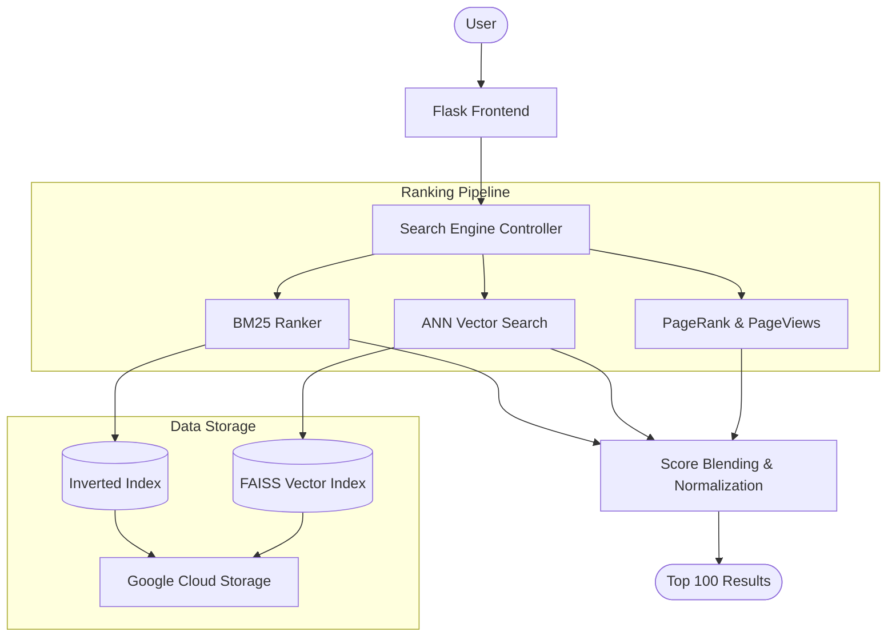

# 🌐 Wikipedia Search Engine

A professional, high-performance search engine built for Wikipedia's massive document corpus (6.3M+ articles). This project features a **hybrid ranking pipeline** that combines traditional lexical search with modern semantic vector retrieval.

---

## 🚀 Key Features

*   **Hybrid Ranking System**: Blends BM25 lexical scores with FAISS-based semantic similarity for superior relevance.
*   **Semantic Search (ANN)**: High-speed vector retrieval using `glove-wiki-gigaword-100` embeddings and Faiss `IndexIVFPQ` quantization.
*   **Custom Inverted Index**: A memory-efficient, multi-level inverted index architecture supporting text, title, and anchor text indexing.
*   **Grid Search Optimization**: Automated hyperparameter tuning (k1, b, weights) via systematic grid search to maximize MAP and precision.
*   **Modern Web Interface**: Clean, responsive frontend built with Flask for real-time query interaction.
*   **GCP Integration**: Ready for deployment on Google Cloud Platform with built-in support for GCS buckets.

---

## 🏗 Architecture

The system follows a modular architecture designed for scalability and low latency:



---

## 🛠 Project Structure

*   `search_frontend.py`: Flask API and web server entry point.
*   `query_engine.py`: Core logic for search orchestration and score blending.
*   `Backend/`:
    *   `ranking.py`: Implementation of BM25, TF-IDF, Cosine Similarity, and ANN search.
    *   `tokenizer.py`: Custom text processing and normalization.
    *   `data_Loader.py`: Efficient loading of indices and PageRank data.
*   `GCP/`: Scripts for building indices and setting up cloud infrastructure.
*   `optimization.py`: Grid search framework for performance tuning.
*   `vector_indexer.py`: Pipeline for generating and indexing semantic embeddings.

---

## 🔧 Setup & Installation

### 1. Prerequisites
- Python 3.9+
- Google Cloud SDK (for GCS access)
- 8GB+ RAM (recommended for index loading)

### 2. Installation
```bash
# Clone the repository
git clone https://github.com/your-repo/wikipedia-search.git
cd wikipedia-search

# Create and activate virtual environment
python -m venv .venv
source .venv/bin/activate  # Windows: .venv\Scripts\activate

# Install dependencies
pip install -r requirements.txt
```

### 3. Data Setup
Download the required indices and place them in the `data/` directory or configure the GCP bucket in `inverted_index_gcp.py`.

---

## 🖥 Usage

Run the development server:
```bash
python search_frontend.py
```
Then navigate to `http://localhost:8080` in your browser.

### API Endpoints
- `GET /search?query=hello`: Main hybrid search.
- `GET /search_body?query=hello`: Search using body text only (BM25).
- `GET /search_title?query=hello`: Search using article titles.
- `POST /get_pagerank`: Get PageRank scores for a list of document IDs.

---

## 📊 Performance & Optimization

The engine has been optimized using **Grid Search** on a training set of queries. Key optimizations include:
- **Index Quantization**: Using `IVFPQ` to reduce vector index memory footprint by 4x.
- **Score Normalization**: Unit-based normalization for blending heterogeneous signals (lexical + semantic + popularity).
- **Batch Processing**: Parquet-based streaming for large-scale embedding indexing.

---

## 👥 Contributors

- **Michael Surazhsky** - [GitHub](https://github.com/michaelsurazhsky)
- **Guy Amzaleg** - [GitHub](https://github.com/guyamzaleg)


---
*Developed as part of the Information Retrieval course at Ben-Gurion University.*